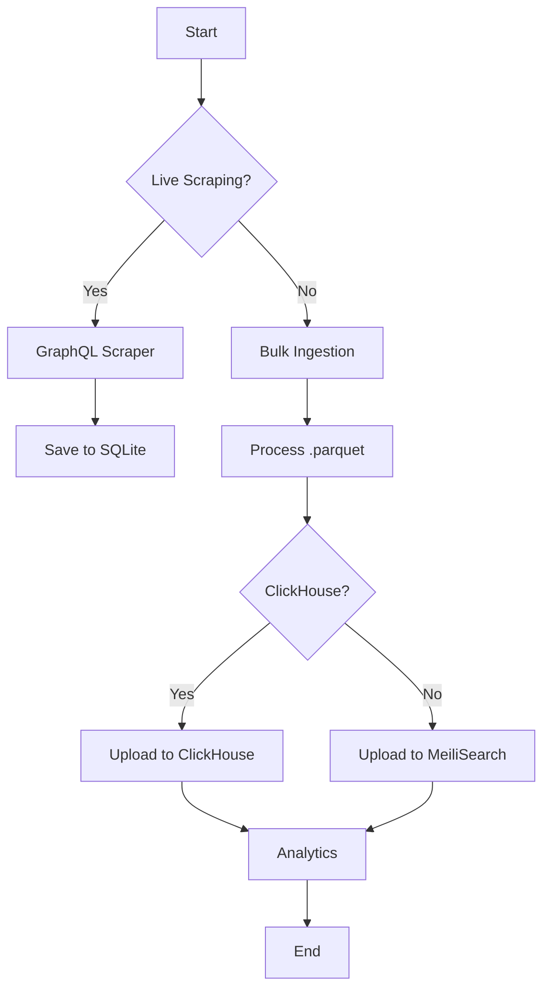

```markdown
# 🎨 Arweave Scraper 🚀

```ascii
                                     _.--""--._
                                   .'          `.
                                  /   O      O   \
                                 |    \  ^^  /    |
                                 \     `----'     /
                                  `. _______ .'
                                    //_____\\
                                   (( ____ ))
                                    `-----'
                               Arweave Blockchain Analytics
```

[](https://github.com/parthks/arweave-scraper/stargazers)
[](https://github.com/parthks/arweave-scraper/network)
[](https://github.com/parthks/arweave-scraper/blob/main/LICENSE)
[](https://www.typescriptlang.org/)
[](https://nodejs.org/)
[](https://www.python.org/)
[](https://cloud.google.com/)


---

## 🌟 Feature Highlights ✨

-   **Live GraphQL Scraping:**  ⚡ Scrape transaction metadata in real-time using GraphQL.  Handles rate limits and gateway failures intelligently.
-   **Bulk Data Ingestion:** 📦 Efficiently processes large `.parquet` datasets (e.g., from indexed.xyz).
-   **Multi-Database Support:** 📊 Integrates with SQLite, ClickHouse, and MeiliSearch for diverse analytical needs.
-   **Resilient Design:** 🛠️ Robust error handling and gateway rotation ensures continuous operation.
-   **Extensible Architecture:** 💻 Easily add new data sources and output destinations thanks to the TypeScript structure.
-   **Typo-Tolerant Search:** 💡 MeiliSearch enables lightning-fast searches, even with typos.


---

## 🛠️ Tech Stack 🛠️

| Technology        | Badge                                                                   |
|--------------------|------------------------------------------------------------------------|
| Node.js           | [](https://nodejs.org/) |
| TypeScript        | [](https://www.typescriptlang.org/) |
| SQLite            | [](https://www.sqlite.org/) |
| ClickHouse        | [](https://clickhouse.com/) |
| MeiliSearch       | [](https://www.meilisearch.com/) |
| Axios             | [](https://axios-http.com/) |
| DuckDB            | [](https://duckdb.org/) |
| ParquetJS         | [](https://github.com/apache/parquet-format) |
| Python           | [](https://www.python.org/) |


---

## 🚀 Quick Start ⚡

1.  **Clone the repository:** `git clone https://github.com/parthks/arweave-scraper.git`
2.  **Install dependencies:** `yarn install`  (and `pip install requests`)
3.  **Update gateways:** `python endpoints.py` (fetches a fresh list of Arweave gateways)
4.  **Run the scraper:** `yarn gql` (for live scraping) or `yarn upload` (for bulk ingestion).  Configure `.env` with API keys.


---

## 📖 Detailed Usage 📚

### Live Scraping (GraphQL)

```bash
yarn gql
```

This starts the live scraper.  The starting block, increment, and concurrency are configurable in `src/index.ts`.

### Bulk Data Ingestion (Parquet)

1.  Place your `.parquet` files in a directory (e.g., `/path/to/your/data`).
2.  Update `folderPath` in `src/main.ts` to point to your data directory.
3.  Run: `yarn upload`


---

## 🏗️ Project Structure 📦

```
arweave-scraper/
├── src/                  # TypeScript source code
│   ├── index.ts          # Live scraping entry point
│   ├── main.ts           # Bulk ingestion entry point
│   ├── ...               # Other modules
├── endpoints.py          # Python script for gateway updates
├── gateways.json         # List of Arweave gateways
├── package.json          # Project dependencies
└── tsconfig.json         # TypeScript compiler config
```


---

## 🎯 API Documentation 📖

<details><summary><b>ClickHouse API</b></summary>

| Function             | Description                                                                                                    |
|----------------------|----------------------------------------------------------------------------------------------------------------|
| `uploadTxnsToClickHouse(batch: BatchData[])` | Uploads a batch of transaction data to ClickHouse.                                                        |

</details>

<details><summary><b>MeiliSearch API</b></summary>

| Function             | Description                                                                                                |
|----------------------|------------------------------------------------------------------------------------------------------------|
| `uploadTxnsToMeiliSearch(batch: BatchData[])` | Uploads a batch of transaction data to MeiliSearch.                                                     |

</details>

---

## 🔧 Configuration Options ⚙️

| Variable           | Description                                      | Type    | Default |
|--------------------|--------------------------------------------------|---------|---------|
| `MEILI_API_KEY`     | MeiliSearch API key                             | string  |         |
| `CLICKHOUSE_USERNAME` | ClickHouse username                              | string  |         |
| `CLICKHOUSE_PASSWORD` | ClickHouse password                              | string  |         |
| `BLOCK_MIN`       | Starting block for GraphQL scraper              | number  | 0       |
| `BLOCK_INCREMENT`   | Block increment for GraphQL scraper              | number  | 100     |
| `folderPath`       | Path to Parquet files for bulk ingestion      | string  |         |


---

## 📸 Screenshots/Demo 📸

**(Add screenshots or GIFs here showcasing the application's functionality)**

---

## 🤝 Contributing Guidelines 🌟

1.  Fork the repository.
2.  Create a new branch (`git checkout -b feature/your-feature`).
3.  Make your changes.
4.  Commit your changes (`git commit -m "Add your feature"`).
5.  Push to your branch (`git push origin feature/your-feature`).
6.  Create a pull request.

---

## 📜 License & Acknowledgments 🙏

This project is licensed under the MIT License - see the [LICENSE](LICENSE) file for details.

---

## 👥 Contributors 🧑‍💻

**(Add contributor avatars and links here)**

---

## 📞 Support & Contact 📧

[](https://twitter.com/parthks)
[](mailto:parthks@example.com)



